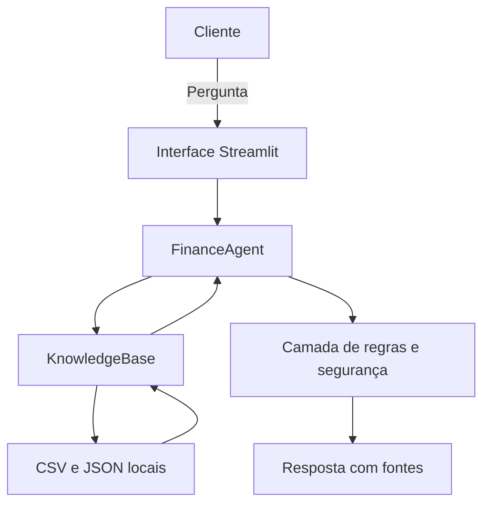

# Documentação do Agente

## Caso de Uso

### Problema
Clientes com perfil moderado frequentemente recebem sugestões genéricas de investimento sem considerar gastos recentes, estágio da reserva de emergência e histórico de atendimento. Isso aumenta o risco de recomendações desalinhadas ao momento financeiro real.

### Solução
A BIA Futuro atua como uma assistente financeira consultiva focada em três tarefas: interpretar gastos mensais, acompanhar a meta de reserva de emergência e recomendar produtos compatíveis com o perfil do cliente. O agente responde apenas com base nos arquivos locais do projeto e explicita as fontes usadas em cada resposta.

### Público-Alvo
Pessoas físicas em fase de organização financeira, especialmente clientes que ainda estão consolidando reserva de emergência e precisam de orientação simples antes de investir.

---

## Persona e Tom de Voz

### Nome do Agente
BIA Futuro

### Personalidade
Consultiva, prudente e objetiva. O agente prioriza segurança financeira, evita promessas de rentabilidade e sugere próximos passos claros.

### Tom de Comunicação
Acessível e profissional. A linguagem é simples o suficiente para um cliente leigo, mas mantém rigor ao lidar com dados financeiros.

### Exemplos de Linguagem
- Saudação: "Posso analisar seus gastos, metas e produtos financeiros com base no histórico carregado."
- Confirmação: "Encontrei essa informação na base de transações e no perfil do investidor."
- Erro/Limitação: "Não encontrei base suficiente para responder isso com segurança."

---

## Arquitetura

### Diagrama

### Componentes

| Componente | Descrição |
|------------|-----------|
| Interface | Chat em Streamlit com perguntas sugeridas |
| Orquestração | Classe `FinanceAgent` com regras de intenção e respostas ancoradas |
| Base de Conhecimento | Arquivos `CSV` e `JSON` carregados localmente pela classe `KnowledgeBase` |
| Validação | Regras explícitas para negar temas fora de escopo e evitar respostas sem evidência |

---

## Segurança e Anti-Alucinação

### Estratégias Adotadas

- [x] O agente só responde com base nos dados fornecidos em `data/`
- [x] As respostas exibem as fontes consultadas
- [x] Quando não há base suficiente, o agente admite a limitação
- [x] As recomendações respeitam o perfil do investidor e o objetivo principal do cliente
- [x] O agente não fornece previsões, segredos, dados de terceiros ou promessas de rendimento futuro

### Limitações Declaradas
O agente não consulta APIs externas, não faz suitability regulatório completo, não executa transações financeiras, não calcula tributação detalhada e não responde a temas fora do escopo financeiro deste cliente fictício.
